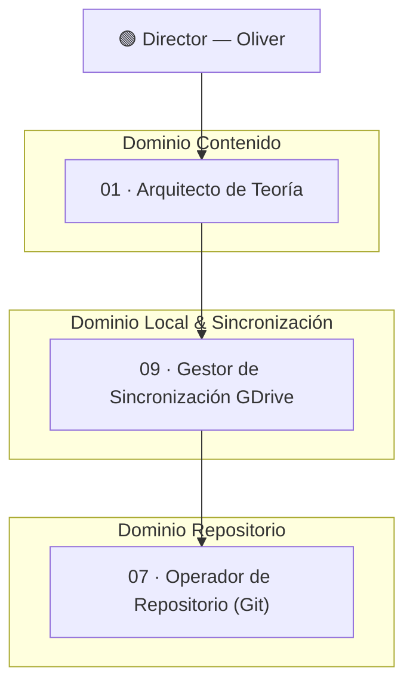

# 01 — Organigrama del Sistema

## Diagrama de estructura organizacional



---

## División por dominios

### 1. Dominio Contenido
*   **01 · Arquitecto de Teoría**: Estructura de cápsulas, temas, secuencia y fundamentación legal.

### 2. Dominio Local & Sincronización
*   **09 · Gestor de Sincronización GDrive**: Limpieza local, auditoría de consistencia de archivos y sincronización con la nube de Google Drive.

### 3. Dominio Repositorio
*   **07 · Operador de Repositorio (Git)**: Control de versiones local (Git) y deploy.

---

## Tiers y responsabilidades detalladas

### Tier 1 — Director (Oliver)
Autoridad final del sistema. Define prioridades, aprueba diseños conceptuales y autoriza toda publicación.

### Tier 2 — Arquitecto de Teoría
Propone diseños de contenido, secuencias pedagógicas y verifica los textos legales verbatim.

### Tier 3 — Gestor de Sincronización GDrive
Gestiona la carpeta local sincronizada con Google Drive, asegurando que las copias locales e índices estén ordenados.

### Tier 4 — Operador de Repositorio (Git)
Realiza commits, control de versiones y push del repositorio.

---

## Regla de autoridad

```
Director > Arquitecto de Teoría > Gestor de Sincronización GDrive > Operador de Repositorio
```
