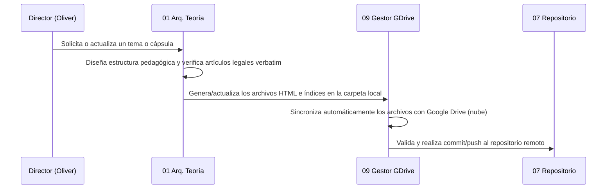

# 01 — Flujos de Trabajo Simplificados

Este documento define el flujo principal de gestión de contenidos y sincronización en CoopeNotebook.

---

## 1. Ciclo de Gestión de Contenido

---

## 2. Descripción de Pasos

1. **Definición y Estructura (Arquitecto de Teoría)**:
   - Se definen las cápsulas y tabs de acuerdo con la pedagogía y la legislación de cooperativas.
   - Todo el contenido legal se escribe verbatim y se asocia a su ID correspondiente en `kb-index.json`.

2. **Sincronización Local y Google Drive (Gestor GDrive)**:
   - Los archivos viven y se editan en el directorio de trabajo local sincronizado con Google Drive (por ejemplo, dentro de `G:\My Drive\CHC\04_Aplicaciones_Desarrollo\coope-notebook`).
   - Los cambios guardados se suben automáticamente a la nube por medio de Google Drive para Escritorio (Google Drive for Desktop).

3. **Control de Versiones y Despliegue (Repositorio)**:
   - Se realiza el control de versiones con Git en el mismo directorio.
   - El push a GitHub dispara el despliegue automático en Vercel para producción.
